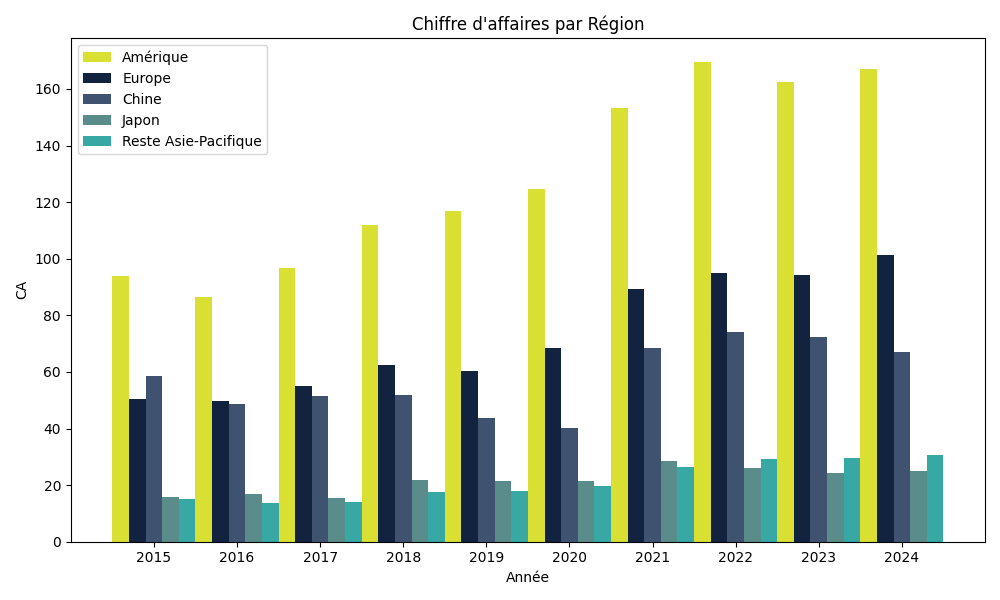

# Data-Visualization-Python
Graphiques réalisés avec Python (Matplotlib, Pandas, NumPy)

🚀 Découvrez ici le code et les graphiques que j'ai créés en exploitant la puissance de la Data Science en Python !

  
